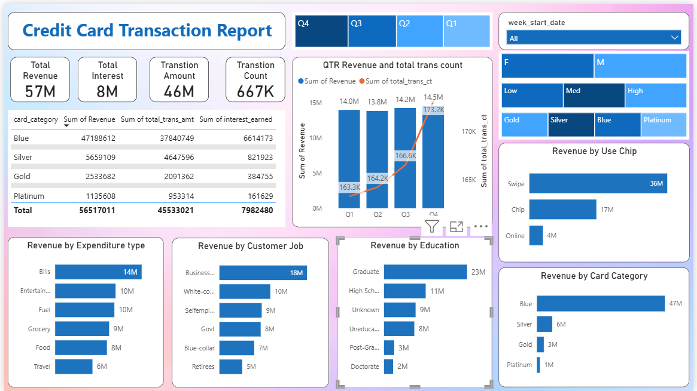
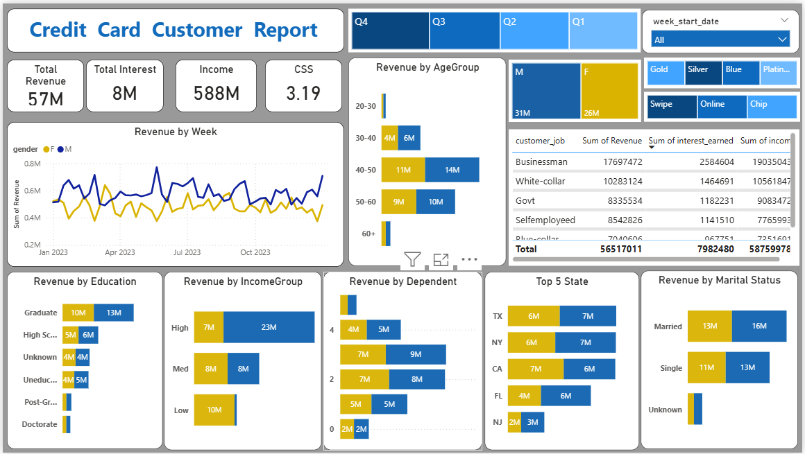

# Credit Card Financial Dashboard

## Overview
This project focuses on analyzing credit card customer data to understand spending behavior, revenue trends, and customer segments using Power BI.

## Objective
The goal of this project is to identify patterns in customer transactions and generate insights that can help in better business decision-making.

## Tools Used
- Power BI
- Excel 

## Key Insights
- Revenue shows consistent growth over time
- Most customers prefer using swipe transactions over online methods
- Middle-aged customers contribute significantly to total revenue
- Blue card category has the highest usage

## Dataset
The dataset includes customer details, transaction data, and card category information.

## Conclusion
This project helped in understanding how customer behavior impacts revenue and how businesses can target the right segment for growth.

## Dashboard Screenshots

